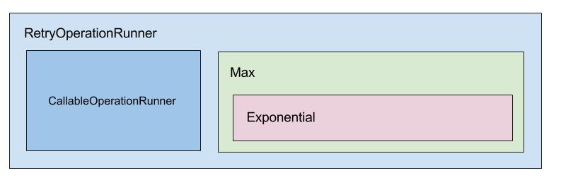

Operation runner
================

Factory
-------

When using simple operation runners, you can create them using the YML configuration of the bundle. Each operation runner
have a name (:code:`default` in the following example). The created operation runner will be available via the service named
:code:`tolerance.operation_runner.default`.

.. code-block:: yaml

    tolerance:
        operation_runners:
            default:
                retry:
                    runner:
                        callback: ~

                    waiter:
                        count_limited:
                            count: 10
                            waiter:
                                exponential_back_off:
                                    exponent: 1
                                    waiter:
                                        sleep: ~

In that example, that will create a operation runner that is the retry operation runner decorating a callable operation runner.
The following image represents the imbrication of the different runners.

.. note::

    This YML factory do not support recursive operation runner. That means that you can't use a chain runner inside
    another chain runner. If you need to create more complex operation runners, you should create your own service
    with a simple factory like `the one that was in the tests before this YML factory <https://github.com/Tolerance/Tolerance/blob/f95bb3ae6a5f331a8d0579a991438f68e28f66f9/tests/Tolerance/Bridge/Symfony/Bundle/AppBundle/Operation/ThirdPartyRunnerFactory.php>`_.

.. tip::

    If you just need to add a decorator on a created operation runner, simply uses `Symfony DIC decorates features. <http://symfony.com/doc/current/components/dependency_injection/advanced.html#decorating-services>`_

Buffered termination
--------------------

If you are using a buffered operation runner, it will automatically run all the buffered operations after the response
it sent to the client (:code:`kernel.terminate` event).

You can disable this feature with the following configuration:

.. code-block:: yaml

    tolerance:
        operation_runner_listener: false

This will automatically work with operation runners created using the factory. If you've created your own service,
you will need to tag it with :code:`tolerance.operation_runner` in order to declare it.

.. code-block:: xml

    <?xml version="1.0" ?>

    <container xmlns="http://symfony.com/schema/dic/services"
               xmlns:xsi="http://www.w3.org/2001/XMLSchema-instance"
               xsi:schemaLocation="http://symfony.com/schema/dic/services http://symfony.com/schema/dic/services/services-1.0.xsd">

        <services>
            <service id="app.my_buffered_operation_runner" class="Tolerance\Operation\Runner\BufferedOperationRunner">
                <!-- Arguments... -->

                <tag name="tolerance.operation_runner" />
            </service>
        </services>
    </container>

