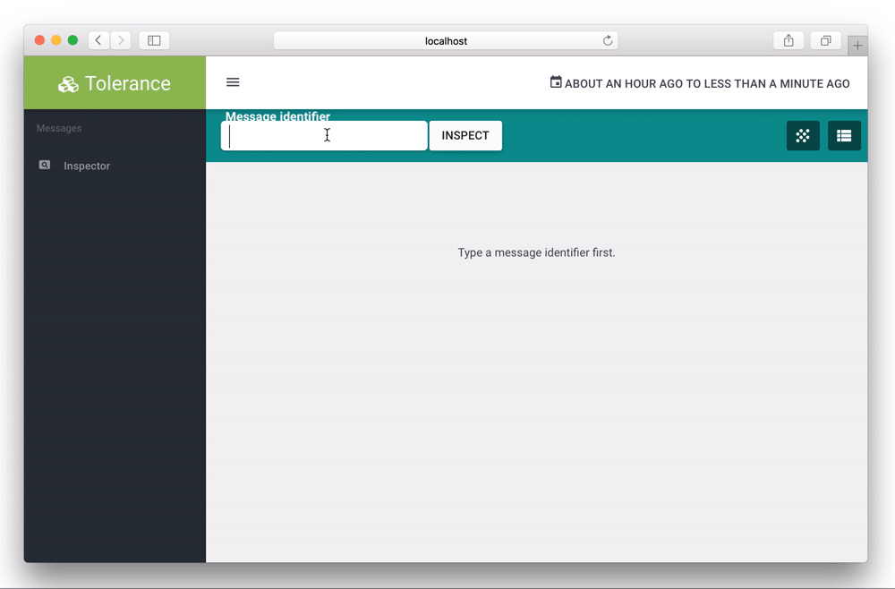

Viewer
======

The Viewer is an AngularJS application (with an API) that allows you to see, from a given message identifier, all the
parent and children requests. If you have a message identifier, then you'll be able to see and inspect all the related
messages.

You can checkout the Viewer application in its own `GitHub repository <https://github.com/Tolerance/Viewer>`_.

.. note::

    In order to use the Viewer, you need to use the Neo4j storage.
