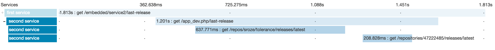

Tracer
======

The Tracer component's goal is to be able to easily setup a tracing of your application messages across different
services.

At the moment, the supported backend is `Zipkin <http://zipkin.io/>`_. Once configured, you'll be able to preview
a given Trace and analyze the time spent by each service.

.. note::

    The Symfony Bundle also `integrates this component <../bridges/symfony-bundle/tracer.html>`_ to ease the setup of
    traces in a Symfony application.
